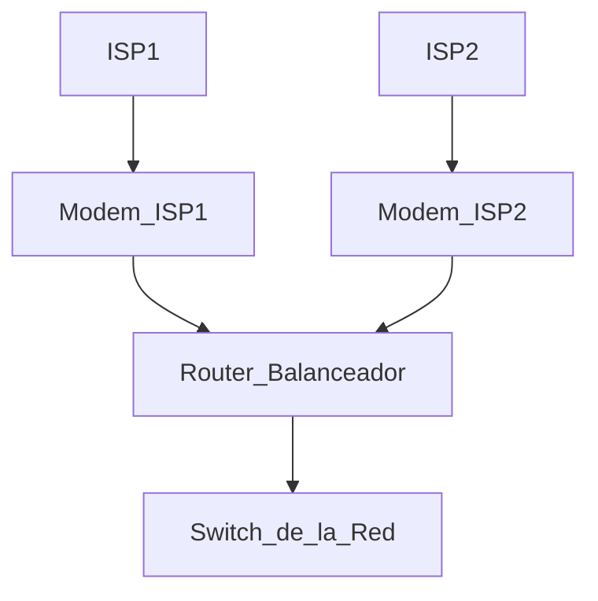

### Configuracion esquematica para usar router balaceador

```mermaid
graph TD;
    ISP1-->Modem_ISP1;
    ISP2-->Modem_ISP2;
    Modem_ISP1-->Router_Balanceador;
    Modem_ISP2-->Router_Balanceador;
    Router_Balanceador-->Switch_de_la_Red;
```
